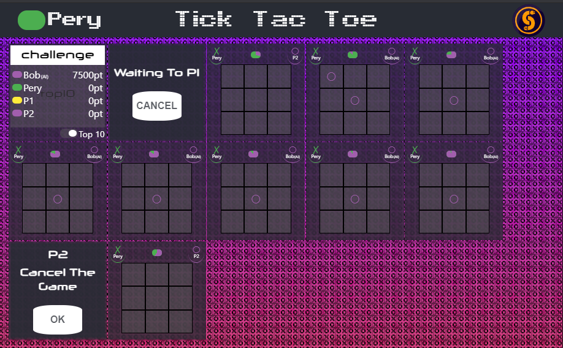

[](https://app.netlify.com/sites/perymimon-tic-tac-toe/deploys)

# Tic-Tac-Toe
Multi Arenas and Multi Players Tic-Tac-Toe Web Game powered by `React V16`, `NodeJS V14` and `socket.io V2.3`
  
## Table of Contents
* [Setup](#setup)  
* [Launch](#launch)   
* [General architecture](#General-Architecture)  
* Helpers:    
[LetMap](#letmap)
[ReactiveModel](#reactivemodel)
[ReactiveSet](#reactiveset)
[UseSocket](#usesocket)
[useLoginUser](#useloginuser)
[useConnected](#useconnected)  

* [Client - Component Hierarchy](#client---component-hierarchy)  
* [Server - Data Flow](#server---data-flow)  
* [Technical Choices](#technical-choices)  
* [Trade Off](#trade-off)  
* [@Rights](#rights)  

## Setup
   * Clone the project
   * On the working folder call `npm install`
## Launch
   * `npm run server` - spin up the server
   * `npm start` - building the client and open `localhost:3000` on default browser 

## General Architecture
The whole project base on `React` and `socket.io` and some hands-write libs of mine.
Client side are heavily depends on `useSocket`, a custom React Hooks that brings models updates from the server.
Server heavily depends on [ReactiveModel](#reactivemodel), a custom data structure that base on JS `proxy`, to know and response to any
change on the `Arena/Game/User` models.
Response can be as a sent model update to the client through `socket.io`
or let the AI know about the change and respond to it.

Game represented by `Arena` and `Game` ideas.
`Arena` is all about to settle place for the game to run, 
and it means a different things in the client and in the server.

On the client, `Arena` component is the dimension place that the game can show all is stages:
`INVITATION` `GAME` `END` `CANCEL` `LOADING`.  

On the server, `Arena` is a function that warp the game instance and take care of everything 
that should me made to have a game that can be played. like: socket connection, memory free, 
tracks `Users` and `game` models and emit the changes, etc.

In this architecture `Game` are isolated and focused on updates his `model`.
So different games can be established with the same arena wrapper function.
 
## Before we dive, some - [Helpers](#helpers) 
Or start diving

## Client - Component Hierarchy
* App  
    * Header  
        * Login User
        * Title
        * Connectivity indicator Symbol
    * Main
        * Router path=/register
            * Register
        * Router path=/
            * Arenas
                * UserList, two views. top10 and all users
                * For each user's arenas: Arena[Stage=INVITATION|GAME|CANCEL|LOADING]

Arena can be in 4  stage 
* INVITATION  - in this stage Invited user asked to Approve or Decline the invitation.
                the inviting user see waiting screen with Abort Button.
* GAME - in this stage players see the board and all the need for playing
* CANCEL - all player see cancel message on the screen with Ok button to remove the Arean.
* LOADING - default stage, show when Arena whiting for game model to arrive from server.

### Client - Data Flow
Data comes from the server on a socket.io stream.
`socket.io-client` open one connection to the server.
And split it, virtually, to separate namespace under the main namespace.  
Before any game can be made, client send the value from `localstorage.userId` to 
the server on `uid` search query parameter.
 If `uid` exist on the server's `users collection` `user.model` send back.
 Then client navigate to `main page` of game.
 Until then `registered-form page` showed.

Every time user click on user on `User List Componnent`, a `challenge` event send to server with the `user` to challenge.
  and a list of all `arenas-id` send back on `arenas` event.  
    
It is the responsible of the client to use each `areana-id` to connect to corresponding
`/game-${game.id}` namespace and listen to update of Arena model from there.

So on the client side that `arena-id`'s list used to create `Arena Component`
and `Arena Compoent` use the custom hook `useSocket` to be regularly updated from `game-${game.id}/update`
namespace/event  

`useSocket` hook also return the `socket` that used for the connection (each namespace has different socket instance).
so `arena component` can used it to emit updates back to the `arena instance` on the server.

From `Arena Compoent` it just simple `Functional Component` all the way down, without any special logic

### Server - Data Flow
The server implantation is relatively simple.
`socket.io` establish listeners for connections request and manage all 
connections to the client.
`express` are added after thought just to bring sanity test on the remote server. 

On each new connection the server get `uid` from search query request.
And check if that `uid` is a `id` of some registered `user`.

If some `user` found with that id server emits 3 different events back to client through socket.io.
1) `user` event with the `user.model` 
2) `arenas` event with a list of all `arenas id` that this user belongs to 
3) `users list` event with the list of `users model` that exist on this server 

Also, server start to listen for 2 events on that socket.
1) `challenge` event, that called with `user` to challenge, and create `Arena` for them to manage the battle.
2) `remove-arena` event, that called with `arena-id` to remove arena from user's arena list   

If user not exist, the server listen for `user-register` event
 and wait it called with with the name of new user. after that server create new user and start 
 listen to the event mentioned above.

When `Arena` "created" it actually created a instance of `Game`
 and open namespace call `game-${game.id}`.
 The `game.id` also added to two users `.arenas` list . that action make the all `.arenas` list 
 send back to the clients. clients use this `ids` to establish the connection to the arena's namesapce.
 So they can start got updates of the game model on `update` event.
  
Each socket that connect to game's namespace got 3 listeners for events that trigger actions that 
 managed the game
1) `cancel` event, to cancel game before it start. either from the inviting or invited users.
2) `approve` event, to approve game and start it by the invited user.
3) `playerSelectCell` event, to make a move on ongoing game.

socket also got another kind of update, on a `game-errors` event.
That event sent a specific errors just to user's socket that made the errors. 

After each action any update to `game-model` emitted to client with `update` event, so the loop is close.  


## Server - Data Models
There is 2 main data model that used for this app in the server, `User` and `Game`,
and 2 collections Singletons to manage them, `Users` and `Arenas`.

### User
Represent by:
```js
class User {
    constructor(name) {
        this.id = uid();
        this.model = ReactiveModel({
            id: this.id,
            name,
            color: randomColor(),
            score: 0,
            disconnect: false
        })

        /* arenas id of this user */
        this.arenas = new ReactiveSet();
    }
    connect(){
        // change model disconnected to false    
    }
    disconnect() {
        // cancel all games participation in;
        // change model disconnected to true
    }

}
```
Other parts of the code tracks after `user.model` and `user.arenas`. `user.model` is what consider
`user` for the client. so it is the public trackble and reflected part of the `user` that sent to the client.
`user.arenas` is a list of all `arenas id` that user participate in. It also trackable and reflected to the client.

Arenas is outside of the `user.model` because it not realy what made the users, and it changed a lot.
 so it designs separate from the user model. 
 although technically if it was in user model the code was still work;
### Users
Users are singleton that inherited from `LetMap`. it manages the all users instance 
and supply `create` that behave as a factory function that warp the user instance
and proxy his model change outside so who can listen to `User.on('update, cb)` notify
also when user model update.

```js
 new class Users extends LetMap {
        create(name, useAI = false) {
            // create user instance and register it    
            // proxy `user.model` change as `Users.on('update', cb)`
            // warp the user with AI if asked
        }

        list(withDisconnected = false) {
            // return all users model for send to socket client.
            // can filter out disconnected or not
        }
        clearDisconnectUsers(){
            // check all register users and delete all of them that disconnected and not
            // participate in any game
        }
}

```
### Game
Represent by:
```js
class Game {
    constructor(user1, user2, turnTime = 5) {
        this.id = uid();
        this.model = ReactiveModel({
            id: this.id,
            playersId: [user1.id, user2.id],
            board: Array(9).fill(''),
            turn: 0,
            nextTurn: 0,
            isStarted: false,
            isCanceled: false,
            turnTime,
            stage: 'INVITATION',
        })

        this.errors = new LetMap(userid => ReactiveModel([]))
    }

    cancel(userid, force = false) {
        // change model stage to 'CANCEL'
        // stop turn time out timer
        // recored who cancel the game     
    }

    approve(userid) {
        // change model stage to 'GAME'
        // start turn timer
    }

    selectCell(userid, cellNumber) {
        // check if the move is ligal
        // update model board with the new move
        // check for and condiations, and mark the wins and losers
    }
}
```
So basically it what you accept from a tic-tac-teo game.
`game.model` is the part that represent and reflected to the clients.
`game.errors` is a channel for each player to know his errors.

## Arenas
Arenas are singleton that inherited from `LetMap`. it manages the all games instance 
and supply `createGame` that behave as a factory function that warp the game instance
and provide all it need to function on the serve without expose it to the connection architecture,
and the real user instance. 
    
```js
new class Arenas extends LetMap {
        createGame(user1 : User, user2 : User) {
            // check ligal stuff
            // create a game instance and register it
            // listen to users areans changes, and `Users` to know if it the time to free up the game 
            // establis namespace socket connection for the game
            // listen to game`s model change and reflect it to the sockets clients
            // listen to commands that come from players socket and moved them to game methods
            // update user instance with the right score
        }

        list() {
            // return all games instances
        }

        attach(io) {
            // helpers to set the main socket connection for `createGame` function 
        }
    }
```    
#### On file helpers/let-map.js
* `export default LetMap extend Map, mixed with EventEmitter` 
## Helpers
LetMap
-------- 
Class that extend the regular js `Map` and expose new method
`for(k)`. That method brings the value's key if it exist  
or if not exist create it with pre provide template .
`LetMap` also emits events on any keys updates or create.

 ```js
  import LetMap from './helpers/let-map'
  const sockets = new LetMap( nsp => new Manger.socket(nsp))
  //... later on code
  const socket = sockets.for(`game/game-${gameId}`) 
 ```    

#### `constractor LetMap(struct:any|function) : letmap`     
Create a new instance of the data structure `LetMap`

Parameter|	type  |	description
---------|--------|------------
`struct`| `any\function`| move directly to `setStuct(struct)` go there for more details | 
    
#### `letmap.setStruct(struct:any|function)`    
Save the template struct for missing keys For future use by `for(k)` method.

Parameter|	type  |	description
---------|--------|------------      
`struct` | `object\function\primitive` | Template for the `letmap.for()`. used to creating new keys.

#### `letmap.for(k: any)`  
This method is like `map.get` but if `k` not exist it creates & return it based on `struct` template.
It work Like that:   
If `struct` is function it called with the `k` and  return's value is the value of that new key.
If `struct.constructor` exist it used to create the new value for the key. `new struct.constructor`. 
If any of that. `struct` assume as primitive value and used as-is to create the new value's key.

Parameter|	type  |	description
---------|--------|------------    
`k` | `any` | used as the key of extended Map  

#### `letmap.on(eventName: string, fn: function)`      
Register callback to specific key change.

Parameter|	type  |	description
---------|--------|------------    
`eventname` | `string` | Eventname is the key that update. also `update` is a special event that emit every time set was updated.
`fn`  | `function` | called as `fn(new value, old value)`  
 
#### `letmap.off(fn)`  
Thin wrapper around `EventEmitter.off`
 
#### `letmap.emit(key: string, nv: any, ol:any, ...rest)`  
Used for manual emit events and let all callbacks to know that.
Some object value of some key updated (because letMat not do any deep checking).
After call it, it  also emit general `update` event

Parameter|	type  |	description
---------|--------|------------    
`key` | `string` | event name should be the name of the key.
`nv` `ov` ...  | `any` |   all arguments transfer as is to `EventEmitter.emit`

#### `letmap.set`, `letmap.delete`  
Behave exactly like `Map.set` but emit events   
#### `letmap.get`  
Behave exactly like `Map.get` 

----------
#### on file helpers/reactive-model.js  
* `export default ReactiveModel factory`  

ReactiveModel
--------------------------------------------
Factory (that can used as decorator in future js) that return deep
trackable object. the model expose `observe(cb)` and any changed to any key of the model in any deep,
even if the key value assigned to different variable, call `cb(model)`.

As a side effect any object that get from the `ReactiveModel` is also `ReactiveModel` with 
is own `observe` method 
```js
const model = ReactiveModel({
    id: 1234,
    board: Array.from(Array(9)),
    turn: 0,
})
model.observe(model=>{
    socket.emit('game-update', model)
})
// later on the code
model.board[4] = 'X'; // in the next eventloop's tick callbacks called
```

#### `Factory ReactiveModel (model: object) : proxy<model>`
Create and return the `ReactiveModel` around the `model`. orginal model not touched at all.

Parameter|	type  |	description
---------|--------|------------    
model    | object |  object to deep track-proxy on   
   
#### `model.observe(cb: function(model)) : function disconnect`
Register cb function to called on any model's changed.
It returns `disconnect` function that remove the `cb` when called. 

Parameter|	type   |	description
---------|---------|------------    
cb       | function(model)| function to call on any model change with    
 
-------------------------------------------------------------------------------------------------------
#### on file helpers/reactive-set.js
* `export default ReactiveSet extends Set` 

ReactiveSet
-----------
#### `constractor ReactiveSet(as Set) : reactiveSet`
The name is similar, but it almost not related to `ReactiveModel`. Expect from they both have the `observe` function.
this thin extends of `Set` bring `observer(cb)` that called immediate each time value added or delete from the set
and when `ReactiveSet` cleared.

```js
import ReactiveSet from  './helpers/reactive-set'

const arenas = ReactiveSet();

//later in the code
socket.on('challange', _=>{
    arena.add( new Arena(user1Id, user2Id) )
})
// other place in the code
const disconnect = arenas.observe( (action,arena) =>{
    if(action==="ADD")    
        arena.model.observe( makeMove );
    if(action === "DELETE")
        arena.model.unobserve( makeMove );
})
```

#### `constractor ReactiveSet(as Set) : reactiveSet`
create new instance of `ReactiveSet()`
Parameter|	type  |	description
---------|-------|------------    
as `Set` | any   |  got any argument that constracture of `Set` can get

#### `reactiveSet.observe(cb:function): function disconnect`
register a `cb` that called `cb(actionType, value, diconectedFn)` every time `ReactiveSet` updated. 
i.e. after `ADD` `DELETE` or `CLEAR`  

Parameter|	type  |	description
---------|-------|------------    
cb       | function   |  function to call after set update. `cb` called with actionType , `value` that we mention, and unregistered callback to remove this callback

#### `reactiveSet.unobserve(cb)`
    remove cb from callback updated list
        
#### `reactiveSet.add` `reactiveSet.delete` `reactiveSet.clear` 
Behave the same as Set expect. but trigger the callback's observed.

-------------------------------------------------------------------------------------------------------
#### on file service/socket.js
* `export useSocket(namespace/event: string, defaultValue: any)`
* `export useLoginUser()`
* `export useIsConnected()`
  

useSocket
---------
#### `useSocket(namespaceEvent: string, defaultValue: any)`
```js
const [user, socket] = useSocket('user',{})
// or
const [game, gameSocket] = useSocket('game-${id}/update', {});
```
Hook that let component to get last data from `{namespace}/{event}'s` socket.io's stream.
And bring the socket.io's `socket` that created and used specialy for that namespace,
so a component can send back notification to exact namespace connection on the server. 

Under the surface the module listen all events from `socket.io`
and save them on `LetMap` under `namespace/event` key. so it ready when `useSocket` ask for them.
It also creates react's `useState` and register it's `setter` so when data on that key updated
it can force update the component

useLoginUser() 
--------------
#### `useLoginUser(): Object<user>`
```js
const loginUser = useLoginUser()
```
Thin wrapper around `useSocket('user', {})` that just return 
the login user.  

useConnected()
--------------
#### `useConnected(): boolean `
```js
const isConnected = useConnected()
```

Return the status of main `mangaer.connected`, and force render when status change from 
`connected` to `disconnected`


## Technical Choices
* There no use of redis to help with scaling `socket.io`, and the architecture not tested on 
scaling environment  
* There is no use for any redundant `redux` style design pattern as it unnecessary and make the code bloat
* Try to make the code more readable than magic. But for Infrastructure I must do some deep magic, for it to work cleanr in other parts;
* some workarround because bugs on `socket.io` lib and using same helpers lib on server and client 

## Trade Off
* All events registered are literal string for the simplicity and clarity
* No implantation yet for history playback . There is no reason not to add in the future.
* most of the file un documents because lake of time and believe of self explanation. 
* implement user disconnect from the server as garbage-collector methods. every `X` seconds.
* no implement for limit number of users that send back to each new connection
* no specific time-out `turnMarker` component, I just reuse `User` component on color view
 
##Sources
This project start as challenge from TalkSpace Company that ask for implement Tic-Tac-Toe game.

## Rights 
All right reserve to pery mimon that this project created by him. 
There is a right to learn and clone this code for commercial and study propose, Provided that:
* Add  credit to Pery Mimon on your `Readme.md` of your source code
* Link to this original repository. so peoples can start it 
* Notify me by email to pery.mimon@gmail.com about the credit.  
